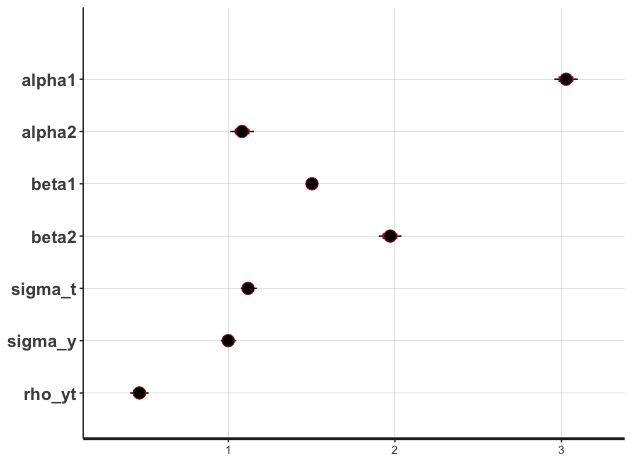

## Instrumental variables approach
IV estimation can be categorized into three uses:

- Simultaneous equation modeling (Wright 1928) <!-- Supply and demand for ag goods -->
- Measurement error (Friedman 1957) <!-- Annual income is a noisy measure of permanent income -->
- Omitted variables/Causal inference (Angrist 1990) <!-- Draft lottery to instrument service on earnings -->

## Instrumental variables approach
Why not OLS?

- Variable of interest is correlated with the error term.

\center{$y=\alpha_1 + x\beta_1 + \epsilon$}

## Instrumental variables approach
Why not OLS?

- Variable of interest is correlated with the error term.

\center{$E[x\epsilon]\neq0$}

\center{$\hat{\beta_1}=(X^\prime X)^{-1}X^\prime y=(X^\prime X)^{-1}X^\prime (X\beta_1 + \epsilon)=\beta_1+(X^\prime X)^{-1}X^\prime \epsilon$}

## Instrumental variables approach
Simulation

```{r}
# Generate instrument data
n <- 1000
z <- rnorm(n)

# Specify error terms with for 1st and 2nd stage
e <- rnorm(n, sd = 1)
u <- rnorm(n, sd = 1)

# Generate 1st and 2nd stage outcomes
x <- 1 + 2 * z + 0.5 * u + e
y <- 3 + 1.5 * x + u

d <- data.frame(z, x, y)
```

## Instrumental variables approach
Simulation

```{r, eval = F}
# OLS results
ols <- lm(y ~ x)
summary(ols)
```

```
Coefficients:
            Estimate Std. Error t value Pr(>|t|)    
(Intercept)  2.93101    0.03328   88.07   <2e-16 ***
x            1.60188    0.01345  119.13   <2e-16 ***
---
```

## Instrumental variables approach
Correct the bias with an IV.

- Introduce an instrument, z, strongly correlated with x but not correlated with $\epsilon$.

\center{$\hat{\beta}_{1,IV}=(Z^\prime X)^{-1}Z^\prime y=(Z^\prime X)^{-1}Z^\prime X\beta_1 + (Z^\prime X)^{-1}Z^\prime \epsilon$}

## Instrumental variables approach
Simulation

```{r, eval = F}
# IV results
iv <- ivreg(y ~ x | z, data = d)
summary(iv)
```

```
Coefficients:
            Estimate Std. Error t value Pr(>|t|)    
(Intercept)  3.02611    0.03497   86.52   <2e-16 ***
x            1.50226    0.01583   94.87   <2e-16 ***
---
```

## Instrumental variables approach

Bayesian IV estimation

- Performs well even with a weakly identified model (i.e. weak instruments)
- Accomodates finite samples

Many thanks to Danilo Freire (King College London) for sharing his code.

## Instrumental variables approach

Bayesian IV estimation: Bayes' Rule

\center{$p(\theta|y) \propto p(\theta)p(y|\theta)$}

- Observe data $y$
- Define model parameters $\theta$
- Specify likelihood function $p(y|\theta)$
- Specify prior densities $p(\theta)$

## Instrumental variables approach

Simulation (R/Stan code is on sweenejo.github.io)

\center{$y=\alpha_1+\beta_1x+u$}
\center{$x=\alpha_2+\beta_2z+e$}

- Use same simulated data as before.
- Define model parameters $\theta=(\alpha_1, \alpha_2, \beta_1, \beta_2, \sigma_1, \sigma_2, \rho)$

## Instrumental variables approach

Simulation

\center{$\begin{bmatrix}u\\e \end{bmatrix}=\begin{bmatrix}\sigma_1^2&\rho\sigma_1\sigma_2\\ \rho\sigma_1\sigma_2&\sigma_2^2\end{bmatrix}$}

- Note, this is similar to what Altonji et al. (2005) do.

## Instrumental variables approach

Simulation

- Likelihood function will be a multivariate normal.
- Specify uniform priors for the variance parameters, and flat normals for the others.

## Instrumental variables approach

Simulation (R/Stan code is on sweenejo.github.io)


## Instrumental variables approach

Simulation



## Instrumental variables approach

Bayesian IV estimation

- Performs well even with a weakly identified model (i.e. weak instruments)
- Accomodates finite samples
- Can a Bayesian approach help us address questions of instrument validity?

## Bayesian likelihood approach

Yes!

> An important advantage of our Bayesian analysis is that neither the exclusion restriction nor the monotonicity assumption is essential, and consequently violations of these assumptions are easily addressed (Imbens and Rubin 1997)

## Bayesian likelihood approach

Let's replicate Imbens and Rubin (1997) to see how useful this approach is.

- Use data from randomized community trial of impact of vitamin A on children's survival (Sommer and Zeger 1991)

\begin{tiny}
\begin{center}
\begin{tabular}{ l c c c c }
  Type ($C$) & Assignment ($Z$) & Vitamin supplements ($D$) & Survival ($Y$) & Number of units \\
  \hline 
  Complier or never-taker & 0 & 0 & 0 & 74 \\
  Complier or never-taker & 0 & 0 & 1 & 11,514 \\
  Never-taker & 1 & 0 & 0 & 34 \\
  Never-taker & 1 & 0 & 1 & 2,385 \\
  Complier & 1 & 1 & 0 & 12 \\
  Complier & 1 & 1 & 1 & 9,663 \\
\end{tabular}
\end{center}
\end{tiny}

## Bayesian likelihood approach

\center{$Y\leftarrow C$}
\center{$C\leftarrow Z$}

- Exclusion restriction: Treatment assigment ($Z$) is not directly correlated with potential outcomes ($Y$).
- Strict monotonicity: We can ignore defiers.

## Bayesian likelihood approach

Let's relax the exclusion restriction. There may be direct correlation between $Z$ and $Y$ (selection).

- Define a set of model parameters
- Probability of survival $\eta_{C,Z}$
- Probability of being a complier $\omega$

Does taking vitamin A increase childrens' survival?

\center{$CACE=\eta_{C,1}-\eta_{C,0}$}

## Bayesian likelihood approach

Specify posterior distribution, which is a product of 5 distributions:

\center{$p(\omega|C, Z, D, Y)\propto p(\omega)\omega^{N_C}(1-\omega)^{N_N}$}
\center{$p(\eta_{C,Z}|C, Z, D, Y)\propto p(\eta_{C,Z})\prod_{i\in C,Z} \eta_{C,Z}^{Y_i}(1-\eta_{C,Z})^{1-Y_i}$}

- Note: We do not observe the compliance status of the control group.  We'll treat this as discrete missing data, and marginalize it out of the distribution.
- This means we will sample from $\omega$ to specify compliance status of missing observations.

## Bayesian likelihood approach

We'll specify flat beta distributions (beta(1,1)) as priors for all parameters.

## Bayesian likelihood approach

Estimates relaxing the exclusion restriction.


## Bayesian likelihood approach

Estimates with the exclusion restriction. ($\eta_N=\eta_{N,0}=\eta_{N,1}$)


## Bayesian likelihood approach

- Supplementing with vitamin A increases childrens' survival by ~0.003%, or saves ~3 children for every 1000.
- Without the exclusion restriction the distribution of CACE has a flat top over a wide range, although the mean is still ~0.003%.

## Bayesian likelihood approach

The Bayesian likelihood approach allows us to relax the fundamental IV assumptions, including the exclusion restriction and strict monotonicity.

- Instead of relying on a handwaving defense of our instruments validity, we can evaluate parameter sensitivity with and without valid instrument assumptions.
- The next steps are to extend this approach to models with continuous parameters.